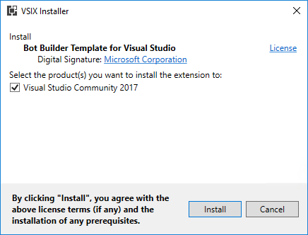

# Lab: Fundamentals of Microsoft Teams development

In this lab, you will prepare your computer for developing Microsoft Teams apps, learn the steps to package and test your application, build a basic Microsoft Teams bot and a Microsoft Teams tab.

## In this lab

1. [Create and test a basic Microsoft Teams app using Yeoman](#exercise1)
1. [Create and test a basic Microsoft Teams bot using Visual Studio](#exercise2)
1. [Call the Microsoft Graph API inside a tab](#exercise3)

## Prerequisites

Developing apps for Microsoft Teams requires preparation for both the Office 365 tenant and the development workstation.

For the Office 365 Tenant, the setup steps are detailed on the [Getting Started page](https://msdn.microsoft.com/en-us/microsoft-teams/setup). Note that while the getting started page indicates that the Public Developer Preview is optional, this lab includes steps that are not possible unless the preview is enabled.

### Install developer tools

The developer workstation requires the following tools for this lab.

#### Install NodeJS & NPM

Install [NodeJS](https://nodejs.org/) Long Term Support (LTS) version. If you have NodeJS already installed please check you have the latest version using `node -v`. It should return the current [LTS version](https://nodejs.org/en/download/). Allowing the **Node setup** program to update the computer `PATH` during setup will make the console-based tasks in this easier to accomplish.

After installing node, make sure **npm** is up to date by running following command:

````shell
npm install -g npm
````

#### Install Yeoman, Gulp, Gulp-cli and TypeScript

[Yeoman](http://yeoman.io/) helps you start new projects, and prescribes best practices and tools to help you stay productive. This lab uses a Yeoman generator for Microsoft Teams to quickly create a working, JavaScript-based solution. The generated solution uses Gulp, Gulp CLI and TypeScript to run tasks.

Enter the following command to install the prerequisites:

````shell
npm install -g yo gulp gulp-cli typescript
````

#### Install Yeoman Teams generator

The Yeoman Teams generator helps you quickly create a Microsoft Teams solution project with boilerplate code and a project structure & tools to rapidly create and test your app.

Enter the following command to install the Yeoman Teams generator:

````shell
npm install generator-teams@preview -g
````

#### Download ngrok

As Microsoft Teams is an entirely cloud-based product, it requires all services it accesses to be available from the cloud using HTTPS endpoints. To enable the exercises to work within Microsoft Teams, a tunneling application is required.

This lab uses [ngrok](https://ngrok.com) for tunneling publicly-available HTTPS endpoints to a web server running locally on the developer workstation. ngrok is a single-file download that is run from a console.

#### Code editors

Tabs in Microsoft Teams are HTML pages hosted in an iframe. The pages can reference CSS and JavaScript like any web page in a browser.

Microsoft Teams supports much of the common [bot framework](https://dev.botframework.com/) functionality. The Bot Framework provides an SDK for C# and Node.

You can use any code editor or IDE that supports these technologies, however the steps and code samples in this training use [Visual Studio Code](https://code.visualstudio.com/) for tabs using HTML/JavaScript and [Visual Studio 2017](https://www.visualstudio.com/) for bots using the C# SDK.

#### Bot template for Visual Studio 2017

Download and install the [bot application template](https://marketplace.visualstudio.com/items?itemName=BotBuilder.BotBuilderV3). The extension can be installed by double-clicking on the VSIX file.

   

