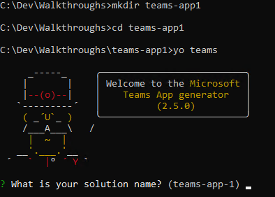
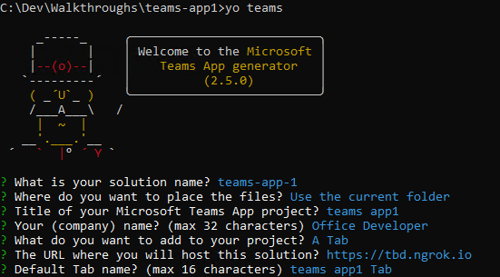
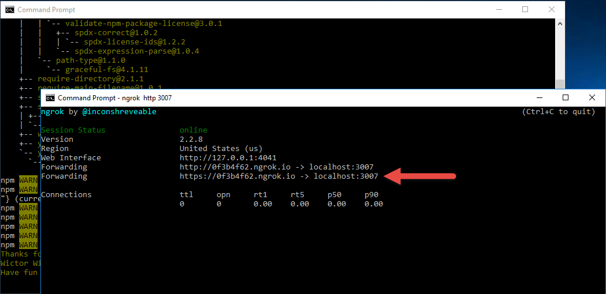
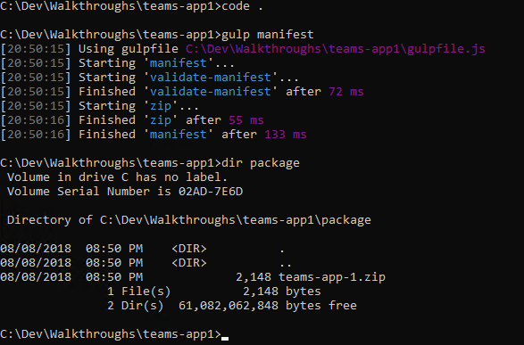
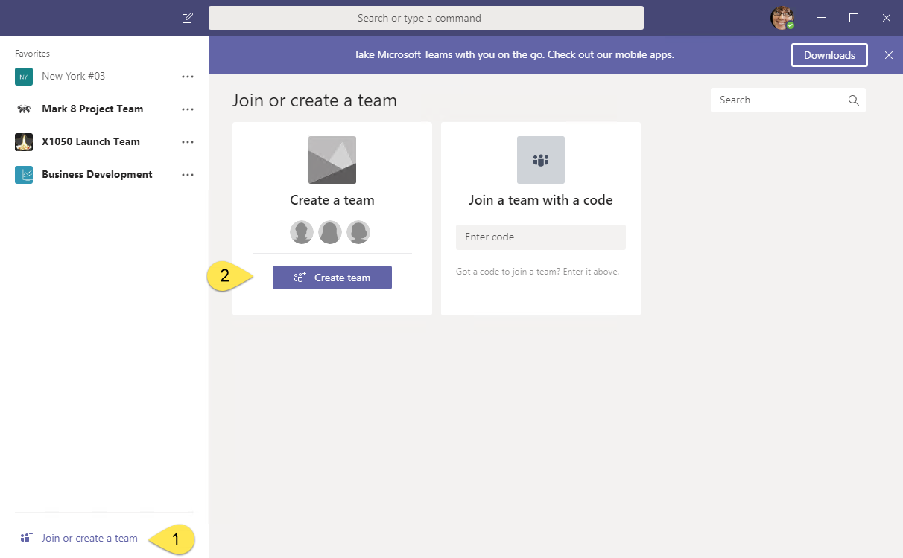

# Lab: Fundamentals of Microsoft Teams development

In this lab, you will prepare your computer for developing Microsoft Teams apps, learn the steps to package and test your application, build a basic Microsoft Teams bot and a Microsoft Teams tab.

## In this lab

1. [Create and test a basic Microsoft Teams app using Yeoman](#exercise1)
1. [Create and test a basic Microsoft Teams bot using Visual Studio](#exercise2)
1. [Call the Microsoft Graph API inside a tab](#exercise3)


<a name="exercise1"></a>

## Exercise 1: Create and test a basic Microsoft Teams app using Yeoman

This exercise introduces the Yeoman generator and its capabilities for scaffolding a project and testing its functionality. In this exercise, you will create a basic Microsoft Teams App.

1. Open a **Command Prompt** window.

1. Change to the directory where you will create the tab.

     > **Note:** Directory paths can become quite long after node modules are imported.  It is recommended that you use a directory name without spaces in it and create it in the root folder of your drive.  This will make working with the solution easier in the future and protect you from potential issues associated with long file paths. In this example, you will use `c:\Dev` as the working directory.

1. Type `md teams-app1` and press **Enter**.

1. Type `cd teams-app1` and press **Enter**.

### Run the Yeoman Teams generator

1. Type `yo teams` and press **Enter**.

    

1. When prompted, accept the default **teams-app-1** as your solution name and press **Enter**.

1. Select **Use the current folder** for the file location and select **Enter**. The next set of prompts asks for specific information about your Microsoft Teams app:
    - Accept the default **teams app1** as the name of your Microsoft Teams app project and press **Enter**.
    - Enter your name and press **Enter**.
    - Accept the default selection of **Tab** for what you want to add to your project and press **Enter**.
    - Enter **https://tbd.ngrok.io** as the URL where you will host this tab and press **Enter**. You will change this URL later in the exercise.
    - Accept the default **teams app1 Tab** as the default tab name and press **Enter**.

      

    At this point, Yeoman will install the required dependencies and scaffold the solution files along with the basic tab. This might take a few minutes. When the scaffold is complete, you should see the following message indicating success.

    

### Run the ngrok secure tunnel application

1. Open a new **Command Prompt** window.

1. Change to the directory that contains the **ngrok.exe** application.

1. Run the command `ngrok http 3007`.

1. The ngrok application will fill the entire prompt window. Make note of the forwarding address using HTTPS. This address is required in the next step.

1. Minimize the ngrok command prompt window. It is no longer referenced in this exercise, but it must remain running.

    

### Update the Microsoft Teams app manifest and create package

When the solution was generated, you used a placeholder URL. Now that the tunnel is running, you need to use the actual URL that is routed to your computer.

1. Return to the first **Command Prompt** window in which the generator was run.

1. Launch **VS Code** by running the command `code .`

    

1. Open the **manifest.json** file in the **manifest** folder.

1. Replace all instances of `tbd.ngrok.io` with the HTTPS forwarding address from the ngrok window. In this example, the forwarding address is **0f3b4f62.ngrok.io**. There are five URLs that need to be changed.

1. Save the **manifest.json** file.

1. In the **Command Prompt** window, run the command `gulp manifest`. This command will create the package as a zip file in the **package** folder.

    

1. Build the webpack and start the express web server by running the following commands:

    ```shell
    gulp build
    gulp serve
    ```

    

    > Note: The gulp serve process must be running in order to see the tab in the Microsoft Teams application. When the process is no longer needed, press **CTRL+C** to cancel the server.

### Upload app into Microsoft Teams

1. In the Microsoft Teams application, select the **Create and join team** link. Then select the **Create team** button.

    

1. Enter a team name and description. In this example, the team is named **Training Content**. Select **Next**.

1. Optionally, invite others from your organization to the team. This step can be skipped in this lab.

1. The new team is shown. In the side panel on the left, select the ellipses next to the team name. Choose **Manage team** from the context menu.

    

1. On the Manage team menu, select **Apps** in the tab strip. Then select the **Upload a custom app** link at the bottom right corner of the application. If you don't have this link, check the sideload settings in the [Getting Started article](https://msdn.microsoft.com/en-us/microsoft-teams/setup).

    

1. Select the **teams-app-1.zip** file from the **package** folder. Select **Open**.

    

1. The app is displayed. Notice information about the app from the manifest (Description and Icon) is displayed.

    

The app is now uploaded into the Microsoft Teams application and the tab is available in the **Tab Gallery**.

### Add tab to team view

1. Tabs are not automatically displayed for the team. To add the tab, select **General** channel in the team.

1. Select the **+** icon at the end of the tab strip.

1. In the tab gallery, uploaded tabs are displayed in the **Tabs for your team** section. Tabs in this section are arranged alphabetically. Select the tab created in this lab.

    

1. The generator creates a configurable tab. When the tab is added to the team, the configuration page is displayed. Enter any value in the **Setting** box and select **Save**.

    

1. The value entered will then be displayed in the tab window.

    

