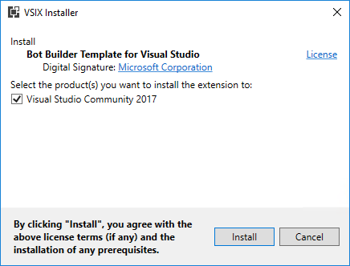

# Lab: Fundamentals of Microsoft Teams development

In this lab, you will prepare your computer for developing Microsoft Teams apps, learn the steps to package and test your application, build a basic Microsoft Teams bot and a Microsoft Teams tab.

## Prerequisites

마이크로소프트 팀즈 앱을 개발하기 위해서는 오피스 365 테넌트와 개발용 워크스테이션이 필요합니다.

오피스 365 테넌트를 준비하려면 다음 링크 페이지의 구성절차에 따라 준비를 진행해 주시기 바랍니다. [Getting Started page](https://msdn.microsoft.com/en-us/microsoft-teams/setup). 이 링크의 페이지에서 Public Developer Preview 이 선택사항이라고 표시되고 있지만, 이 핸즈온랩을 정상적으로 완료하려면 Preview 가 꼭 활성화 되어 있어야만 하는 점을 주의하십시오.

### Install developer tools

본 핸즈온랩을 진행하기 위해서 개발자의 워크스테이션에 아래의 도구들이 설치되어 있어야 합니다.

#### Install NodeJS & NPM

[NodeJS](https://nodejs.org/) Long Term Support (LTS) version 을 설치하십시오. 만약 NodeJS 가 이미 설치되어 있다면 `node -v` 명령어로 설치된 프로그램이 최신버전인지 확인 해 주십시오. [LTS version](https://nodejs.org/en/download/) 과 동일해야 합니다. 

NodeJS 를 설치하고 난 후, 아래의 명령어를 실행하여 **npm**을 최신으로 업데이트 해주십시오.

````shell
npm install -g npm
````

#### Install Yeoman, Gulp, Gulp-cli and TypeScript

[Yeoman](http://yeoman.io/) 은 새로운 프로젝트를 쉽게 시작할 수 있도록 도와주는 도구 입니다. 이 핸즈온 랩에서는 Microsoft 팀즈용 Yeoman 제네레이터을 이용하여 빠르게 자바스크립트 기반 솔루션을 만드는 내용이 포함되어 있습니다. 이렇게 생성된 솔루션이 구동될 때에는 Gulp, Gulp CLI, TypeScript 가 사용됩니다.

사전 구성 요소를 준비하기 위해 아래의 명령어를 실행하십시오.

````shell
npm install -g yo gulp gulp-cli typescript
````

#### Install Yeoman Teams generator

Yeoman 팀즈 제네레이터는 보일러플레이트 코드와 프로젝트 구조 및 기타도구를 가진 Microsoft 팀즈 솔루션 프로젝트를 빠르게 만들고 테스트 할 수 있도록 해줍니다.

Yeoman 팀즈 제네레이터를 설치하기 위해 아래의 명령아를 실행하십시오.

````shell
npm install generator-teams@preview -g
````

#### Download ngrok

Microsoft 팀즈는 전적으로 클라우드 기반의 제품이기 때문에, 여기에 엑세스하는 모는 서비스는 HTTPS 엔드포인트를 이용하여 클라우드에서 접속이 가능해야 합니다. 따라서 Microsoft 팀즈에서 개발된 프로그램을 테스트 하기 위해서는 터널링 프로그램이 필요합니다.

이 핸즈온랩은 [ngrok](https://ngrok.com)을 이용하여 개발자의 워크스테이션 로컬에서 구동되는 웹서버를 외부에서 접근가능한 HTTPS 엔드포인트로 터널링해줍니다. ngrok 은 콘솔 명령창에서 실행하는 파일하나짜리 프로그램입니다.

#### Code editors

Microsoft 팀즈의 탭은 iframe 에서 호스팅 되는 HTML 페이지 입니다. 이 페이지들은 브라우저에서 표시되는 다른 웹페이지들과 같이 CSS 와 자바스크립트를 참조하여 사용할 수 있습니다.

Microsoft 팀즈는 대부분의 일반적인 [bot framework](https://dev.botframework.com/) 기능을 지원합니다. 봇 프레임웍은 C#과 Node를 위한 SDK를 제공합니다.

이러한 기술들을 지원하는 어떠한 코드 에디터나 IDE를 사용해도 됩니다만, 이 핸즈온랩의 내용에서는 HTML/자바스크립트로 구현하는 탭은 [Visual Studio Code](https://code.visualstudio.com/)를, C# SDK를 활용한 봇 개발을 위해서는 [Visual Studio 2017](https://www.visualstudio.com/) 을 사용합니다.


#### Bot template for Visual Studio 2017

[bot application template](https://marketplace.visualstudio.com/items?itemName=BotBuilder.BotBuilderV3) 를 다운로드 하여 설치해 주십시오. 이 확장 프로그램은 VSIX 파일을 더블클릭하여 설치할 수 있습니다.


   

