# <a name="exercise1"></a>

## Exercise 1: Create and test a basic Microsoft Teams app using Yeoman

이 과정은 Yeoman generator를 소개하고 이를 이용하여 프로젝트를 스캐폴딩하고 테스트까지 하는 내용을 다룹니다. 이 과정에서는 기본적인 Microsoft 팀즈앱을 만들게 될 것입니다.

1. **Command Prompt**창을 엽니다.

1. 탭을 만들 디렉토리로 이동합니다.

     > **Note:** node 모듈이 임포트 된 후 디렉토리 경로가 굉장히 길어질 수 있습니다. 그러므로 디렉토리 이름에 공백을 사용하지 않도록 하고, 또한 드라이브의 루트폴더에 프로젝트를 만드는 것을 추천합니다. 이러한 구성이 장래에 솔루션을 다루기에 보다 쉬우며, 너무 긴 파일 경로에 의헤 유발되는 잠재적인 이슈를 피할 수 있는 방법입니다. `c:\Dev` 를 작업 디렉토리로 사용하는 것을 예로 들어볼 수 있겠습니다.

1. `md teams-app1` 이라고 타이핑 하고 **Enter** 키를 누릅니다..

1. `cd teams-app1` 이라고 타이핑 하고 **Enter** 키를 누릅니다.

### Run the Yeoman Teams generator

1. `yo teams` 이라고 타이핑 하고 **Enter** 키를 누릅니다.

    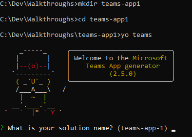

1. 프롬프트로 물어보면, 기본값인 **teams-app-1** 을 그대로 솔루션 이름으로 두고 **Enter** 키를 누릅니다.

1. 파일의 위치에 대해 **Use the current folder** 를 선택하고 **Enter** 키를 누릅니다. 이어지는 다음의 프롬프트들은 여러분이 만들고 있는 Microsoft 팀즈 앱의 정보를 묻는 것입니다:
    - 기본값인 **teams app1** 을 팀즈 앱 프로젝트의 이름으로 그대로 두고 **Enter** 키를 누릅니다.
    - 당신의 이름을 입력하고 **Enter** 키를 누릅니다.
    - 기본 선택지인 **Tab** 을 what you want to add to your project 의 답변으로 두고 **Enter** 키를 누릅니다.
    - **https://tbd.ngrok.io** 을 탭을 호스트할 URL 로 지정하고 **Enter** 키를 누릅니다. 나중에 이 URL 주소를 바꿀 수 있습니다.
    - 기본값인 **teams app1 Tab** 을 기본 탭 이름으로 그대로 두고 **Enter** 키를 누릅니다.

      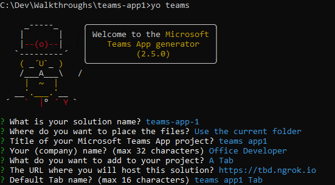

    이 단계에서, Yeoman 이 필요한 종속 모듈을 설치하고 베이직탭에 필요한 솔루션 파일들을 스캐폴딩 하게 됩니다. 이 작업은 몇 분정도 걸릴 수 있습니다. 스캐폴딩 작업이 끝나면, 작업이 성공했음을 알리는 아래와 같은 메시지를 보게 될 것입니다.

    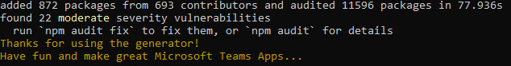

### Run the ngrok secure tunnel application

1. 새로운 **Command Prompt** 창을 엽니다.

1. **ngrok.exe** 프로그램이 있는 디렉토리로 이동합니다.

1. 다음 명령어를 실행합니다. `ngrok http 3007`.

1. ngrok 프로그램이 전체 프롬프트 창을 채울 것입니다. 이 때 HTTP 를 사용하는 포워딩 주소를 확인해 주십시오. 이 주소가 다음 단계에서 필요합니다.

1. ngrok 이 실행중인 프롬프트 창을 최소화 해두십시오. 이번 연습에서는 더이상 참고할 일이 없을 것입니다. 최소화 된 상태로 계속 실행중이어야 합니다.

    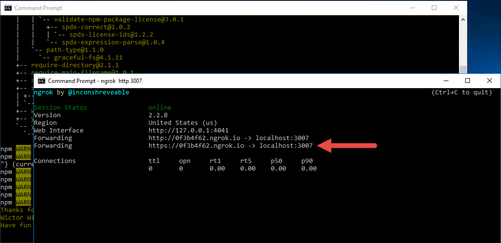

### Update the Microsoft Teams app manifest and create package

솔루션이 생성될 때, 임의로 설정된 URL 이 사용되었습니다. 이제 터널링 프로그램이 동작하고 있으니 우리의 컴퓨터로 라우팅 되는 실제 URL로 변경하여 사용해야 합니다.

1. 솔루션 제네레이터를 실행했던 첫번째의 **Command Prompt** 창으로 돌아갑니다.

1. `code .` 명령어를 실행하여 **VS Code** 를 시작합니다.

    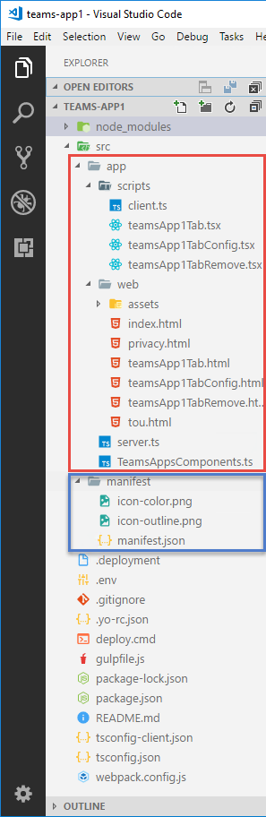

1. **manifest** 폴더안에 있는 **manifest.json** 파일을 엽니다.

1. `tbd.ngrok.io`로 설정된 모든 주소들을 앞전의 ngrok 창에서 얻은 HTTPS 포워딩 주소로 교체해 줍니다. 예를 들어 포워딩 주소가 **0f3b4f62.ngrok.io** 라면, 이것으로 5개의 주소가 변경될 것입니다.

1. **manifest.json** 파일을 저장합니다.

1. **Command Prompt** 창에서, `gulp manifest` 명령을 실행하십시오. 이 명령어를 실행하면 패키지가 만들어지며, **package** 폴더안에 zip 파일로 저장됩니다.

    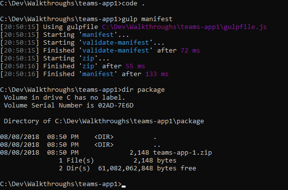

1. 아래의 명령어를 수행하여 webpack 을 빌드하고, 익스프레스 웹서버를 시작합니다:

    ```shell
    gulp build
    gulp serve
    ```

    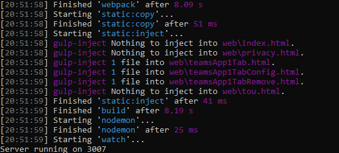

    > Note: gulp serve 프로세스틑 팀즈에서 탭을 보여주기 위해서 구동됩니다. 이 프로세스가 더이상 필요하지 않다면, **CTRL+C** 를 눌러 서버구동을 중지하십시오.

### Upload app into Microsoft Teams

1. 팀즈에서 **Create and join team** 링크를 선택하고, **Create team** 버튼을 클릭하십시오.

    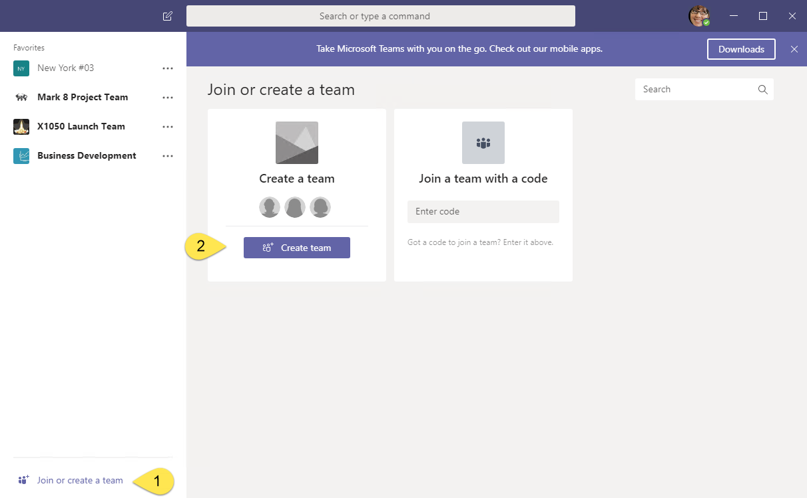

1. 팀의 이름과 설명을 입력하십시오. 예를 들면 팀의 이름은 **Training Content** 으로 입력하고, **Next** 를 클릭합니다.

1. 선택사항으로, 팀에 조직내의 다른 사용자를 초대할 수도 있습니다. 이번 핸즈온랩에서는 이 작업은 필요하지 않습니다.

1. 새로운 팀이 만들어 졌습니다. 왼쪽의 사이드 패널에서, 팀이름의 옆에 있는 타원모양을 찾아 클릭하십시오. 표시되는 컨텍스트 메뉴중에서 **Manage team** 을 선택합니다.

    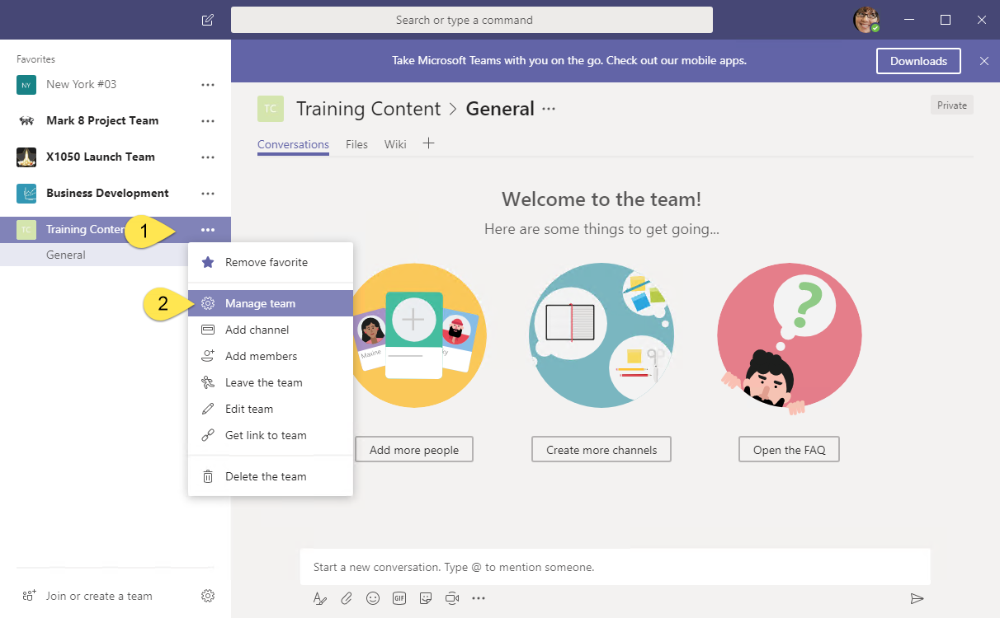

1. Manage team 메뉴에서 **Apps** 탭을 선택합니다. 그런 다음 프로그램 창의 오른쪽 하단에 있는 **Upload a custom app** 링크를 찾아 클릭합니다. 만약 이 링크가 없다면, [Getting Started article](https://msdn.microsoft.com/en-us/microsoft-teams/setup) 페이지를 참조하여 사이드로드 설정을 체크해 주십시오.

    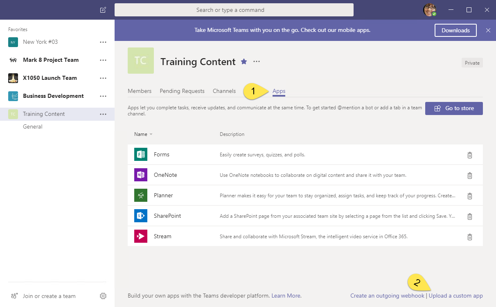

1. **package** 폴더안에 있는 **teams-app-1.zip** 파일을 선택하고, **Open** 을 클릭합니다.

    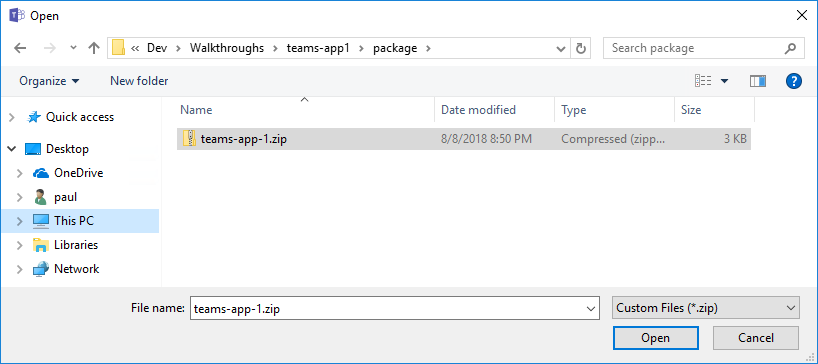

1. 앱이 표시됩니다. manifest 에 설정된 앱의 정보(앱설명과 아이콘)가 표시되는 것을 확인해 주십시오. 

    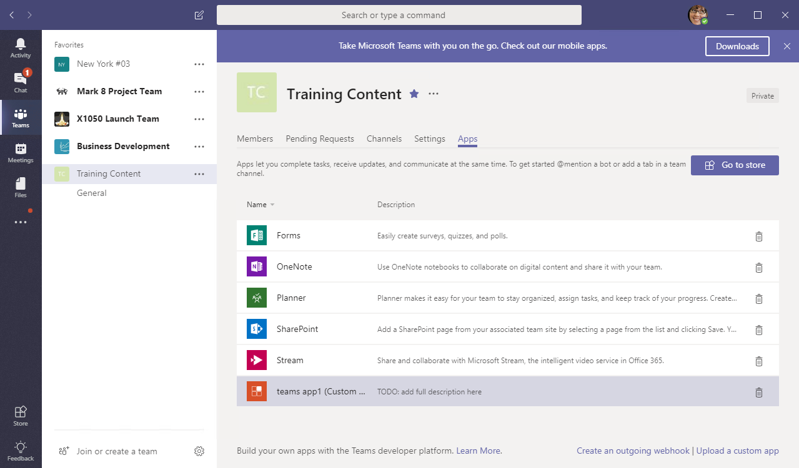

앱이 팀즈에 업로드 되었으며, **Tab Gallery** 에서 탭을 사용할 수 있게 되었습니다.

### Add tab to team view

1. 탭이 팀에 자동으로 보여지지는 않습니다. 탭을 추가하려면, 팀의 **General** 채널을 선택하십시오.

1. 탭영역의 끝에 있는 **+** 아이콘을 클릭하십시오.

1. 탭 갤러리의 **Tabs for your team** 섹션에 방금 업로드한 탭이 보여질 것입니다. 이 섹션의 탭들은 알파벳 순서로 정렬됩니다. 이번 핸즈온랩에서 만든 탭을 찾아 클릭하십시오.

    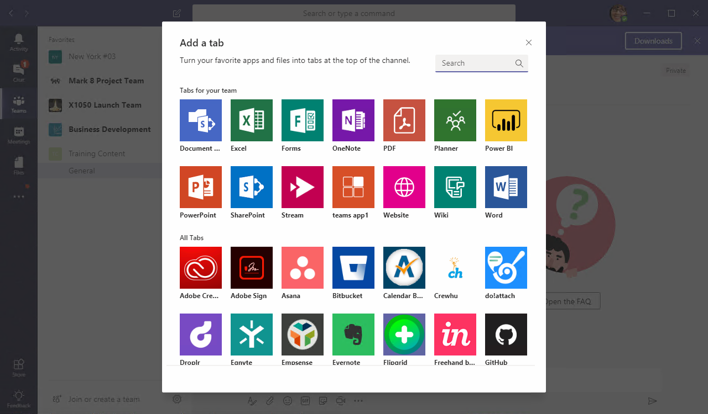

1. 솔루션 제네레이터로 만든 탭은 설정이 가능한 탭입니다. 따라서 탭이 팀에 추가될 때, 설정 페이지가 보여집니다. **Setting** 상자에 아무 값이나 넣고 **Save** 를 클릭하십시오.

    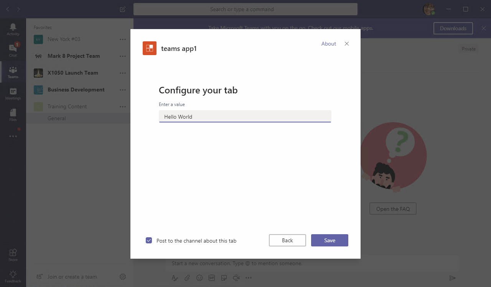

1. 입력한 값이 탭창에 표시될 것입니다.

    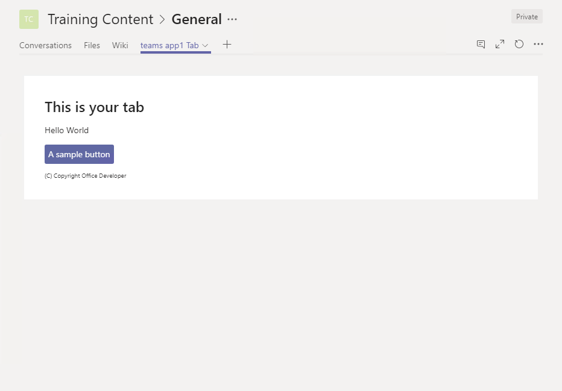

