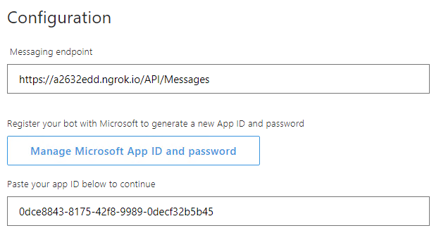
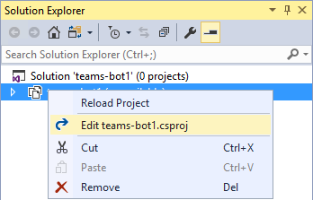

# Lab: Fundamentals of Microsoft Teams development

In this lab, you will prepare your computer for developing Microsoft Teams apps, learn the steps to package and test your application, build a basic Microsoft Teams bot and a Microsoft Teams tab.

## In this lab

1. [Create and test a basic Microsoft Teams app using Yeoman](#exercise1)
1. [Create and test a basic Microsoft Teams bot using Visual Studio](#exercise2)
1. [Call the Microsoft Graph API inside a tab](#exercise3)


<a name="exercise2"></a>

## Exercise 2: Create and test a basic Microsoft Teams bot using Visual Studio

This section of the lab introduces the Bot Framework template and its capabilities for scaffolding a project and testing its functionality. In this exercise, you will create a basic Microsoft Teams bot.

1. Launch Visual Studio 2017 as an administrator.

1. In Visual Studio 2017, select **File > New > Project**.

1. Create a new Bot Framework project using the **Bot Builder Echo Bot** template.

   

    The bot application template is a fully functional echo bot that takes the user's text utterance as input and returns it as output. In order to run the bot inside Microsoft Teams:

    - The bot must be accessible from the internet
    - The bot must be registered with the Bot Connector
    - The `AppId` and `AppSecret` from the Bot Framework registration page have to be recorded in the project's `web.config`
    - The bot must be added to Microsoft Teams

    Before registering the bot, note the URL configured for the solution in Visual Studio.

1. In Solution Explorer, double-click on **Properties**.

1. In the **Properties** designer, select the **Web** tab.

1. Note the **Project URL**.

    

### Run the ngrok secure tunnel application

1. Open a new **Command Prompt** window.

1. Download [ngrok](https://ngrok.com/download) and unzip the **ngrok secure tunnel application**. Change to the directory that contains the **ngrok.exe** application.

1. Run the command `ngrok http [port] -host-header=localhost:[port]` Replace `port` with the port portion of the URL noted above.

1. The ngrok application will fill the entire prompt window. Make note of the forwarding address using HTTPS. This address is required in the next step.

1. Minimize the ngrok command prompt window. It is no longer referenced in this lab, but it must remain running.

    

### Register the bot

1. Go to the [Microsoft Bot Framework create page](https://dev.botframework.com/bots/new) at https://dev.botframework.com/bots/new. (Do not use the Create button on the Bot Framework portal home page, as this will redirect to the Azure Portal.) Sign in with your work or school account. If necessary, accept the Terms of service.

1. Complete the bot profile section, entering a display name, unique bot handle and description.

    

1. Complete the configuration section.
    - For the **Messaging endpoint**, use the forwarding HTTPS address from ngrok with `/api/messages` appended to provide the route to the **MessagesController** in the Visual Studio project. In the example, this is `https://a2632edd.ngrok.io/api/messages`.
    - Select the **Create Microsoft App ID and password button** to open a new browser window.
    - In the new browser window the application is registered in Azure Active Directory. Select **Generate an app password to continue**. An app secret is generated. Copy the secret and save it. You will use it in a subsequent step.
    - Select **OK** to close the dialogue box.
    - Select the **Finish and go back to Bot Framework** button to close the new browser window and populate the app ID in the **Paste your app ID below to continue textbox**.

        

1. Move to the bottom of the page. Agree to the privacy statement, terms of use, and code of conduct and select the **Register** button. Once the bot is created, select **OK** to dismiss the dialogue box. The **Connect to channels** page is displayed for the newly-created bot.

**Note:** The Bot migration message (shown in red) can be ignored for Microsoft Teams bots.

1. The bot must then be connected to Microsoft Teams. Select the **Teams** logo.

    

1. When the connection is complete, ensure the connection is enabled and select **Done**.

    

    The bot registration is complete. Selecting **Settings** in the top navigation will re-display the profile and configuration sections. This can be used to update the messaging endpoint in the event ngrok is stopped, or the bot is moved to production.

### Configure the web project

The bot project must be configured with information from the registration.

1. In Visual Studio, open the **Web.config** file. Locate the `<appSettings>` section.

1. Enter the `BotId` value. The `BotId` is the **Bot handle** from the **Configuration** section of the registration.

1. Enter the `MicrosoftAppId`. The `MicrosoftAppId` is the app ID from the **Configuration** section of the registration.

1. Enter the `MicrosoftAppPassword`. The `MicrosoftAppPassword` is the auto-generated app secret displayed in the dialogue box during registration. If you do not have the app secret, the bot must be deleted and re-registered. An app secret cannot be reset nor displayed.

### Test the bot using the portal

The Bot registration portal can be used to test the bot.

1. Ensure ngrok is still running, and the Messaging endpoint of the bot registration is using the hostname shown as the forwarding HTTPS address in ngrok.

1. In Visual Studio, select **F5** to start the project.

1. When the **default.htm** page is displayed, return to the [Bot registration portal](https://dev.botframework.com/bots).

1. Select your bot.

1. In the top-right corner of the page, select the **Test** button.

1. Enter a message and select **Enter**. The message is echoed back along with the length of the message. If the message cannot be sent, there is an error in the configuration of the Bot registration, ngrok and Visual Studio. The request should be visible in the ngrok command window. For additional detail on the request in ngrok, open the address `http://localhost:4040`. If no requests are displayed in ngrok, then the Messaging endpoint has the wrong hostname, or there is a disruption in the network connectivity.

    

### Configure Visual Studio to package bot

Packaging a bot for Microsoft Teams is identical to packaging a tab. A manifest file and related resources are compressed into a zip file and added to a team. The follow steps will be performed in Visual Studio.

1. Stop debugging before continuing but leave ngrok running.

1. Right-click on the project, choose **Add > New Folder**. Name the folder **Manifest**.

1. Add the displayed files from the **Lab Files** folder of this repository.

    

1. Open the **manifest.json** file just added to the project. The **manifest.json** file requires several updates:
      - The `id` property must contain the app ID from registration. Replace the token `[microsoft-app-id]` with the app ID.
      - The `packageName` property must contain a unique identifier. The industry standard is to use the bot's URL in reverse format. Replace the token `[from-ngrok]` with the unique identifier from the forwarding address.
      - The `developer` property has three URLs that should match the hostname of the Messaging endpoint. Replace the token `[from-ngrok]` with the unique identifier from the forwarding address.
      - The `botId` property in the `bots` collection property also requires the app ID from registration. Replace the token `[microsoft-app-id]` with the app ID.
      - Save and close the **manifest.json** file.

### Compress the manifest folder

1. In Solution Explorer, right-click on the project and choose **Unload Project**. If prompted, select **Yes** to save changes.

    

1. Right-click on the project file and choose **Edit [project-name].csproj**.

    

1. Move to the end of the file. Add the following target to the file. Be sure to add the target outside of the comment. This target will invoke a custom build task to compress the files in the manifest directory.

    ```xml
    <Target Name="AfterBuild">
      <ZipDir InputBaseDirectory="manifest"
              OutputFileName="$(OutputPath)\$(MSBuildProjectName).zip"
              OverwriteExistingFile="true"
              IncludeBaseDirectory="false" />
    </Target>
    ```

1. Add the following Task element to the **.csproj** file.

    ```xml
    <UsingTask TaskName="ZipDir" TaskFactory="CodeTaskFactory"
              AssemblyFile="$(MSBuildToolsPath)\Microsoft.Build.Tasks.v4.0.dll">
      <ParameterGroup>
        <InputBaseDirectory ParameterType="System.String" Required="true" />
        <OutputFileName ParameterType="System.String" Required="true" />
        <OverwriteExistingFile ParameterType="System.Boolean" Required="false" />
        <IncludeBaseDirectory ParameterType="System.Boolean" Required="false" />
      </ParameterGroup>
      <Task>
        <Reference Include="System.IO.Compression" />
        <Reference Include="System.IO.Compression.FileSystem" />
        <Using Namespace="System.IO.Compression" />
        <Code Type="Fragment" Language="cs"><![CDATA[
          if (File.Exists(OutputFileName))
          {
            if (!OverwriteExistingFile)
            {
              return false;
            }
            File.Delete(OutputFileName);
          }
          ZipFile.CreateFromDirectory
          (
            InputBaseDirectory, OutputFileName,
            CompressionLevel.Optimal, IncludeBaseDirectory
          );
        ]]></Code>
      </Task>
    </UsingTask>
    ```

1. **Save** and **close** the project file.

1. In **Solution Explorer**, right-click on the project and choose **Reload Project**.

1. Select **F5** to run the project. The new **AfterBuild target** will run, creating a zip file in the build output folder (`bin`).

### Upload app into Microsoft Teams

Although not strictly necessary, in this lab you will add the bot to a new team.

1. In the Microsoft Teams application, select the ellipses next to the team name. Choose **Manage team** from the menu.

    

1. On the manage team page, select **Apps** in the tab strip. Then select the **Upload a custom app** link at the bottom right corner of the application.

1. Select the **teams-bot1.zip** file from the **bin** folder. Select **Open**.

1. The app is displayed. Notice the description and icon for the app from the manifest is displayed.

    

    The app is now uploaded into the Microsoft Teams application and the bot is available.

### Interact with the bot

1. In the general channel for the team, a message is created announcing the bot has been added to the team. To interact with the bot, @ mention the bot.

    

1. As you test the bot, you will notice that the character count is not correct. You can set breakpoints in the Visual Studio project to debug the code. (Remember, however, that the count was correct using the registration portal.) Later modules of this training will review how to remove mentions from the message.

