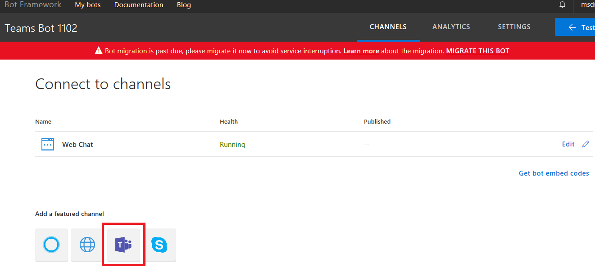

# <a name="exercise2"></a>

## Exercise 2: Visual Studio를 사용하여 Basic Microsoft Teams Bot 생성

 Bot Framework 템플릿 프로젝트를 기반한 기능을 테스트 하기위해 Lab을 진행하고 기본 Microsoft Teams Bot을 생성합니다. 

1. Visual Studio 2017 을 관리자 권한으로 실행합니다.

1. Visual Studio 2017 - **File > New > Project** 메뉴를 선택합니다.

1. **Bot Builder Echo Bot V4 template**을 사용해 새로운 Bot Framework project를 생성합니다

   

    Bot application template는 사용자 텍스트 언어를 Input 으로 받아 Output으로 리턴하는 기능의 에코봇입니다 Microsoft Teams에서 Bot을 실행하기위해 다음 내용을 기본으로 합니다:

    - Bot은 반드시 인터넷에 연결되어 있어야 합니다
    - Bot은 반드시 Bot Connector에 등록되어야 합니다 
    - Bot Framework 등록페이지에서 `AppId` 와 `AppSecret` 을 프로젝트의 `web.config` 에 기록합니다 
    - Bot은 Microsoft Teams에 추가되어야 합니다 

    Bot을 등록하기전 Visual Studio에서 솔루션용으로 구성된 URL을 기록합니다 

1. 솔루션 탐색기에서 **Properties** 을 더블클릭합니다.

1. **Properties** 디자이너에서 Debug탭을 선택하고 **App URL**을 기록합니다 

    

### ngrok 보안 터널 응용프로그램 실행

1. **Command Prompt** 를 실행합니다.

1. [ngrok](https://ngrok.com/download) 를 다운로드하고 **ngrok secure tunnel application (ngrok 보안 터널 응용프로그램)** 압축을 풀어 **ngrok.exe** 응용프로그램이 있는 디렉토리를 변경합니다

1. `ngrok http [port] -host-header=localhost:[port]` 커멘드를 실행합니다 (`port` 는 앞서 기록한 URL port 로 변경합니다)

1. ngrok 응용 프로그램이 전체 프롬프트 창으로 전환되면 HTTPS를 사용할 포워딩 주소를 기록합니다 이 주소는 다음 단계에서 필요합니다 

1. ngrok Command Prompt 를 최소화 해둡니다 이번 Lab에서는 더 이상 창을 사용하지 않지만 계속 실행된 상태를 유지하도록 합니다.

    

### Bot 등록 

1. [Microsoft Bot Framework create page](https://dev.botframework.com/bots/new) 사이트로 이동합니다 (Bot Framework 포탈 홈페이지의 Create 생성 버튼을 사용하면 Azure Portal로 직접 이동하므로 Lab에서는 사용하지 않습니다) 사이트에 로그인하고 필요한 경우 약관에 동의합니다.

1. Bot 프로필 섹션, 표시이름, 고유한 Bot handle과 설명을 작성합니다 (고유한 값으로 지정해 중복되지 않도록 합니다)

    

1. Configuration 섹션을 작성합니다.
    
    - **Messaging endpoint**를 위해 ngrok의 포워딩 HTTPS 주소와 `/api/messages` 를 추가하여 Visual Studio 프로젝트의 **MessagesController**에 대한 경로를 지정합니다. 
    예를 들어 `https://d8115b65.ngrok.io/api/messages` 과 같습니다
    - **Create Microsoft App ID and password button** 를 클릭하면 새창으로 연결됩니다
    - 새 브라우저 창에서 응용 프로그램이 Azure Active Directory에 등록됩니다 **Generate an app password to continue** 를 선택하고 앱의 비밀번호가 생성되면 복사해서 별도 메모장에 저장합니다 이것은 다음단계에서 사용합니다 
    - 대화상자에서 **OK** 클릭해서 창을 닫습니다
    - **Finish and go back to Bot Framework**를 클릭해 새창을 닫고 **Paste your app ID below to continue textbox**에 앱 ID를 확인해 별도 메모장에 저장해둡니다

        

1. 페이지 하단에 보호 정책, 이용 약관 및 행동 강령에 동의하고 **Register** 버튼을 클릭한 후 새로 생성된 Bot에 **Connect to channels** 페이지가 나타납니다

    **Note** : 붉은색으로 표시되는 Bot migration 경고 메시지는 무시합니다 

1. Bot은 Microsoft Teams에 연결되어야 하므로 **Teams** 로고를 선택합니다.

    

1. 연결이 완료되면 활성화 상태를 확인하고 **Save** 합니다 .

    

### 웹 프로젝트 구성

Bot 프로젝트는 반드시 등록된 정보로 구성되어야 합니다 .

1. Visual Studio에서 **BotConfigration.bot**파일을 열어 내용을 수정합니다.

1.	`endpoint` 값을 입력합니다 

1.	`BotId` 값을 입력합니다 Id 는 **Configuration** 섹션에서 **Bot handle** 입니다

1.	`MicrosoftAppId` 를 입력합니다 AppId 는 **Configuration** 섹션에서 **app ID** 입니다

1.	`MicrosoftAppPassword` 를 입력합니다. AppPassword 는 등록중 자동으로 생성된 **Password** 입니다. 만약 비밀번호가 없다면 Bot을 삭제후 재등록 해야 합니다. App 비밀번호는 리셋이나 다시 표시가 불가능합니다 

   

### 포탈에서 Bot 테스트

Bot 등록 포탈에서 Bot을 테스트 할 수 있습니다.

1. ngrok이 계속 실행중이고 Bot 등록 메시징 엔드포인트가 포워딩 HTTPS 주소로 표시된 호스트네임을 사용하고 있습니다

1. Visual Studio 에서 **F5**키로 프로젝트를 시작합니다.

1. **default.htm** 페이지가 나타나면 [Bot registration portal](https://dev.botframework.com/bots) 로 돌아갑니다.

1. **Bot**을 선택하고 페이지의 상단 우측 코너에 **Test** 버튼을 클릭합니다.

1. 간단한 텍스트 메시지를 입력하고 **엔터**를 클릭합니다. 입력한 메시지는 에코되어 돌어옵니다. 만약 메시지를 보낼수 없으면 Bot 등록과정, ngrok, visual studio 구성에 오류가 있는 것 입니다. 리퀘스트는 ngrok 명령 창에 표시됩니다. ngrok 에서 요청에 대한 자세한 내용을 보려면 `http://localhost:[port]` 주소를 오픈합니다 ngrok에 요청이 표시되지 않으면 메시징 엔드 포인트의 호스트 이름이 잘못되었거나 네트워크 연결 장애입니다.

    

### Bot 패키지를 위한 Visual Studio 구성

Microsoft Teams Bot 패키징은 탭 패키징과 동일합니다 manifest 파일과 관련된 리소스는 압축하여 ZIP 파일로 추가합니다 Visual Studio에서 다음 단계를 진행하세요.

1. 계속하기전 디버깅을 중지하고 ngrok 실행상태를 확인합니다.

1. 프로젝트를 마우스 우클릭 - **Add > New Folder** 이름은 **Manifest** 지정합니다.

1. **Lab files** 폴더에서 표시된 파일을 복사하여 추가합니다.

    

1. 프로젝트에 추가한 **manifest.json** 파일을 열어 몇가지 업데이트를 합니다:

    - `id` 속성은 등록된 App ID를 포함해야 합니다 `[microsoft-app-id]` 토큰을 App ID로 변경합니다
    - `packageName` 속성은 고유한 식별자를 포함해야 합니다 산업표준은 Bot URL을 역순으로 사용합니다 `[from-ngrok]` 토큰을 nrgok 포워딩 주소의 고유식별자로 변경합니다
    - `developer` 속성은 메시징 엔드포인트 호스트 이름과 일치하는 3개의 URL 을 가집니다 `[from-ngrok]`토큰을 포워딩 주소의 고유식별자로 변경합니다
    - `botId` 속성은 등록했던 app ID가 필요합니다 `[microsoft-app-id]` 토큰을 app ID로 변경합니다
    - **manifest.json** 파일을 저장하고 닫기합니다

    

### manifest 폴더 압축

1. 솔루션 탐색기에서 프로젝트를 마우스 우클릭 - **Unload Project** 를 선택합니다. 프롬프트 창이 나타나면 **YES** 하고 저장합니다

1. 프로젝트 파일에서 마우스 우클릭 - **Edit [project-name].csproj**. 선택합니다.

1. 파일의 끝으로 이동해서 다음 내용을 코멘트 외 타겟으로 추가합니다 이것은 사용자 지정 빌드 작업을 호출하여 매니페스트 디렉터리 파일을 압축합니다.

    ```xml
    <Target Name="AfterBuild">
      <ZipDir InputBaseDirectory="manifest"
              OutputFileName="$(OutputPath)\$(MSBuildProjectName).zip"
              OverwriteExistingFile="true"
              IncludeBaseDirectory="false" />
    </Target>
    ```

1. **.csproj** 파일에 아래 Task element 를 추가합니다.

    ```xml
    <UsingTask TaskName="ZipDir" TaskFactory="CodeTaskFactory"
              AssemblyFile="$(MSBuildToolsPath)\Microsoft.Build.Tasks.v4.0.dll">
      <ParameterGroup>
        <InputBaseDirectory ParameterType="System.String" Required="true" />
        <OutputFileName ParameterType="System.String" Required="true" />
        <OverwriteExistingFile ParameterType="System.Boolean" Required="false" />
        <IncludeBaseDirectory ParameterType="System.Boolean" Required="false" />
      </ParameterGroup>
      <Task>
        <Reference Include="System.IO.Compression" />
        <Reference Include="System.IO.Compression.FileSystem" />
        <Using Namespace="System.IO.Compression" />
        <Code Type="Fragment" Language="cs"><![CDATA[
          if (File.Exists(OutputFileName))
          {
            if (!OverwriteExistingFile)
            {
              return false;
            }
            File.Delete(OutputFileName);
          }
          ZipFile.CreateFromDirectory
          (
            InputBaseDirectory, OutputFileName,
            CompressionLevel.Optimal, IncludeBaseDirectory
          );
        ]]></Code>
      </Task>
    </UsingTask>
    ```

1. 프로젝트 파일을 **저장**하고 **닫기** 합니다

1. **솔루션 탐색기**에서 프로젝트를 마우스 우클릭 - **Reload Project* 를 선택합니다.

1. **F5** 키를 눌러 프로젝트를 실행하면 새로운 **AfterBuild target**이 실행되어 빌드출력폴더 (`bin`)에 ZIP 파일을 생성합니다.

### Microsoft Teams 에App 업로드

반드시 필요한 작업은 아니지만 이번 Lab에서는 새로운 개별 팀에 Bot을 추가합니다.

1. Microsoft Teams 프로그램에서 팀이름 옆의 확장 메뉴를 클릭하고 **Manage Team**를 클릭합니다.

    

1. 팀 관리 페이지에서 **Apps**를 선택하고 우측 하단의 **업로드 앱**을 선택합니다 

1. **bin** 폴더에서 **Teams-bot.zip** 파일을 선택하고 **열기** 합니다 

1. 앱이 표시되며 manifest를 통해 앱의 설명과 아이콘이 함께 표시됩니다 

    

    App은 이제 Microsoft Teams에 업로드 되었고 Bot을 사용할 수 있습니다.

### Bot과 인터렉션

1. 팀의 일반 채널에서 해당팀에 Bot이 추가되었다는 메시지 알림이 나타납니다 Bot과 대화하기 위해서는 **@botname**을 멘션하세요

    


