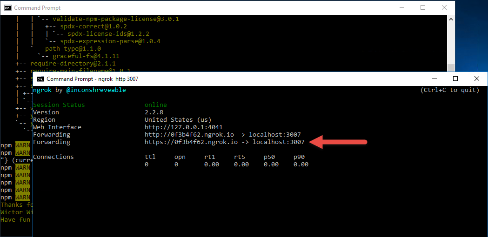

# Lab: Fundamentals of Microsoft Teams development

In this lab, you will prepare your computer for developing Microsoft Teams apps, learn the steps to package and test your application, build a basic Microsoft Teams bot and a Microsoft Teams tab.

## In this lab

1. [Create and test a basic Microsoft Teams app using Yeoman](#exercise1)
1. [Create and test a basic Microsoft Teams bot using Visual Studio](#exercise2)
1. [Call the Microsoft Graph API inside a tab](#exercise3)


<a name="exercise3"></a>

## Exercise 3: Call the Microsoft Graph API inside a tab

This section of the lab will extend the tab created in Exercise 1 to call the Microsoft Graph API. The exercise contains many code files. The **Lab Files** folder contains files that contain the code and are provided to facilitate copying the code.

### Run the ngrok secure tunnel application

1. Open a new **Command Prompt** window.

1. Change to the directory that contains the **ngrok.exe** application.

1. Run the command `ngrok http 3007`.

1. The **ngrok** application will fill the entire prompt window. Make note of the forwarding address using HTTPS. This address is required in the next step.

1. Minimize the ngrok command prompt window. It is no longer referenced in this exercise, but it must remain running.

    

### Register an application in AAD

To enable an application to call the Microsoft Graph API, an application registration is required. This lab uses the [Azure Active Directory v2.0 endpoint](https://docs.microsoft.com/en-us/azure/active-directory/develop/active-directory-v2-compare).

1. Open the [Application Registration Portal](https://apps.dev.microsoft.com).

1. Log in with a work or school account.

1. Select **Add an app**.

1. Complete the **Register your application** section by entering an application name and contact email. Clear the checkbox for **Guided Setup**. Select **Create**.

    

1. On the registration page, in the **Platforms** section, select **Add Platform**.

    

1. In the **Add Platform** dialog, select **Web**.

1. Using the hostname from ngrok, enter a **Redirect URL** to the **auth.html** file.

    ```
    https://[replace-this].ngrok.io/auth.html
    ```

1. Select the **Add URL** button.

1. Using the hostname from ngrok, enter a **Redirect URL** to the **adminconsent.html** file.

    ```
    https://[replace-this].ngrok.io/adminconsent.html
    ```

    

1. Select **Save**.

1. Make note of the application ID. This value is used in the authentication / token code.

### Request permission to read groups

1. Move to the **Microsoft Graph Permissions** section.

1. Next to **Delegated Permissions**, select the **Add** button.

1. In the **Select Permission** dialog, scroll down and select **Group.Read.All**. Select **OK**.

      

1. Select **Save**.

### Add the Microsoft Authentication Library (MSAL) to the project

1. Open a **Command Prompt** window.

1. Change to the directory containing the tab application.

1. Run the following command:

    ```shell
    npm install msal
    ```

### Configure tab when added to channel

The tab in this exercise can be configured to read information from Microsoft Graph API about the current member or about the group in which the channel exists. Perform the following to update the tab configuration.

**Note:** These steps assume that the application created in Exercise 1 is named **teams-app-1**. Paths listed in this section are relative to the **src/app/** folder in the generated application.

1. Open the file **scripts/teamsApp1TabConfig.tsx**.
1. At the top of the file is an `import` statement with several components from `msteams-ui-components-react`. Add `Dropdown` to the list of components.
1. Locate the `IteamsApp1TabConfigState` class. Rename the `value` property to `selectedConfiguration`.

    ```typescript
    export interface IteamsApp1TabConfigState extends ITeamsBaseComponentState {
      selectedConfiguration: string;
    }
    ```

1. Locate the `teamsApp1TabConfig` class. Create the following member variables by inserting the lines before the first method.

    ```typescript
    configOptions = [
      { key: 'MBR', value: 'Member information' },
      { key: 'GRP', value: 'Group information (requires admin consent)' }
    ];
    selectedOption: string = "";
    tenantId?: string = "";
    ```

1. In the `teamsApp1TabConfig` class is a method named `componentWillMount`. In this method, there is a call to `microsoftTeams.getContext`. Update the `getContext` callback to use the proper state variable, and to update the tenant id.

    ```typescript
    microsoftTeams.getContext((context: microsoftTeams.Context) => {
      this.tenantId = context.tid;
      this.setState({
        selectedConfiguration: context.entityId
      });
      this.setValidityState(true);
    });
    ```

1. In the `componentWillMount` method is a call to `microsoftTeams.settings.setSettings`. Update the parameter of this method call to use the proper state variable.

    ```typescript
    microsoftTeams.settings.setSettings({
      contentUrl: host + "/teamsApp1Tab.html?data=",
      suggestedDisplayName: 'teams app1 Tab',
      removeUrl: host + "/teamsApp1TabRemove.html",
      entityId: this.state.selectedConfiguration
    });
    ```

1. Add the following snippet as a new method to the `teamsApp1TabConfig` class.

    ```typescript
    private onConfigSelect(cfgOption: string) {
      let selectedItem = this.configOptions.filter((pos, idx) => pos.key === cfgOption)[0];
      if (selectedItem) {
        this.setState({
          selectedConfiguration: selectedItem.key
        });
        this.selectedOption = selectedItem.value;
        this.setValidityState(true);
      }
    }
    ```

1. The tab configuration page has a button for granting admin consent. Admin consent requires the `tenantId`, which is not known until runtime, so the button has an `onclick` event. Add the following function to the `teamsApp1TabConfigure` class.

    ```typescript
    private getAdminConsent() {
      microsoftTeams.authentication.authenticate({
        url: "/adminconsent.html?tenantId=" + this.tenantId,
        width: 800,
        height: 600,
        successCallback: () => { },
        failureCallback: (err) => { }
      });
    }
    ```

1. Locate the `<PanelHeader>` element. Replace the text of the `<div>` element.

    ```html
    <div style={styles.header}>Settings</div>
    ```

1. Locate the `<PanelBody>` element. Replace the contents of the `<PanelBody>` element with the following snippet.

    ```typescript
    <PanelBody>
      <div style={styles.section}>Microsoft Graph Functionality</div>
      <Dropdown
        autoFocus
        mainButtonText={this.selectedOption}
        style={{ width: '100%' }}
        items={
          this.configOptions.map((cfgOpt, idx) => {
            return ({ text: cfgOpt.value, onClick: () => this.onConfigSelect(cfgOpt.key) });
          })
        }
      />
      <div style={styles.section}>
        <PrimaryButton onClick={() => this.getAdminConsent()}>Provide administrator consent - click if Tenant Admin</PrimaryButton>
      </div>
    </PanelBody>
    ```

1. Add a new file to the **web** folder named **adminconsent.html**.

1. Add the following to the **adminconsent.html** file.

    ```html
    <!DOCTYPE html>
    <html lang="en">

    <head>
      <meta charset="UTF-8">
      <title>AdminConsent</title>
      <!-- inject:css -->
      <!-- endinject -->
    </head>

    <body>
      <script src="https://statics.teams.microsoft.com/sdk/v1.0/js/MicrosoftTeams.min.js"></script>
      <!-- inject:js -->
      <!-- endinject -->

      <script type="text/javascript">
        function getURLParam(name) {
          var url = window.location.search.substring(1);
          var variables = url.split('&');
          for (var i = 0; i < variables.length; i++) {
            var variable = variables[i].split('=');
            if (variable[0] === name) {
              return decodeURIComponent(variable[1]);
            }
          }
        }

        var ac = new teamsApp1.AdminConsent();

        var response = getURLParam("admin_consent");
        if (response) {
          ac.processResponse(true);
        } else {
          var error = getURLParam("error_description")
          if (error) {
            ac.processResponse(false, error);
          } else {
            var tenantId = getURLParam("tenantId");
            ac.requestConsent(tenantId);
          }
        }
      </script>
    </body>
    </html>
    ```

1. Add a new file to the **scripts** folder named **adminconsent.ts**.

1. Add the following to the **adminconsent.ts** file. There is a token named `app-id-from-registration` that must be replaced. Use the value of the Application ID copied from the application registration page.

    ```typescript
    /**
    * Implementation of the teams tab1 AdminConsent page
    */
    export class AdminConsent {
      /**
      * Constructor for Tab that initializes the Microsoft Teams script and themes management
      */
      constructor() {
        microsoftTeams.initialize();
      }

      public requestConsent(tenantId:string) {
        let host = "https://" + window.location.host;
        let redirectUri = "https://" + window.location.host + "/adminconsent.html";
        let clientId = "[app-id-from-registration]";
        let state = "officedev-trainingconent"; // any unique value

        var consentEndpoint = "https://login.microsoftonline.com/common/adminconsent?" +
                              "client_id=" + clientId +
                              "&state=" + state +
                              "&redirect_uri=" + redirectUri;

        window.location.replace(consentEndpoint);
      }

      public processResponse(response:boolean, error:string){
        if (response) {
          microsoftTeams.authentication.notifySuccess();
        } else {
          microsoftTeams.authentication.notifyFailure(error);
        }
      }
    }
    ```

1. Locate the file **scripts/client.ts**.

1. Add the following line to the bottom of **scripts/client.ts**.

    ```typescript
    export * from './adminconsent';
    ```

1. Following the steps from [Exercise 1]("#exercise1") , redeploy the app.

1. Add the tab to a channel, or update the settings of the tab in the existing channel. To update the settings of an existing tab, select the chevron next to the tab name.

    

1. Click the **Provide administrator consent - click if Tenant Admin** button.

    

1. Verify that the Azure Active Directory login and consent flow completes. If you log in with an account that is not a tenant administrator, the consent action will fail. Admin consent is only necessary to view the group calendar, not the member information.

    

### Content page and authentication

With the tab configured, the content page can now render information as selected.  Perform the following to update the tab content.

**Note:** These steps assume that the application created in Exercise 1 is named **teams-app-1**. Paths listed in this section are relative to the **src/app/** folder in the generated application.

1. Open the file **scripts/teamsApp1Tab.tsx**.

1. Locate the `IteamsApp1TabState` interface. Replace the interface definition with the following.

    ```typescript
    export interface IteamsApp1TabState extends ITeamsBaseComponentState {
      entityId?: string;
      graphData?: string;
    }
    ```

1. Locate the `teamsApp1Tab` class. Add the following class-level variable declarations.

    ```typescript
    configuration?: string;
    groupId?: string;
    token?: string;
    ```

1. Add the following function to the `teamsApp1Tab` object. This function runs in response to the button selection.

    ```typescript
    private getGraphData() {
      let token = "";

      let graphElement = document.getElementById("graph");
      graphElement!.innerText = "Loading...";
      if (token == null) {
        microsoftTeams.authentication.authenticate({
          url: "/auth.html",
          width: 400,
          height: 400,
          successCallback: (data) => {
            // Note: token is only good for one hour
            token = data!;
            this.getData(token);
          },
          failureCallback: function (err) {
            document.getElementById("graph")!.innerHTML = "Failed to authenticate and get token.<br/>" + err;
          }
        });
      }
      else {
        this.getData(token);
      }
    }
    ```

1. Add the following method to the `teamsApp1TabTab` class. This method uses XMLHTTP to make a call to the Microsoft Graph API and displays the result.

    ```typescript
    public getData(token: string) {
      let graphEndpoint = "https://graph.microsoft.com/v1.0/me";
      if (this.configuration === "group") {
        graphEndpoint = "https://graph.microsoft.com/v1.0/groups/" + this.groupId;
      }

      var req = new XMLHttpRequest();
      req.open("GET", graphEndpoint, false);
      req.setRequestHeader("Authorization", "Bearer " + token);
      req.setRequestHeader("Accept", "application/json;odata.metadata=minimal;");
      req.send();
      var result = JSON.parse(req.responseText);
      document.getElementById("graph")!.innerHTML = `<pre>${JSON.stringify(result, null, 2)}</pre>`;
    }
    ```

1. Locate the `<PanelBody>` element. Replace that element with the following code snippet.

    ```typescript
    <PanelBody>
      <div style={styles.section}>
        {this.state.graphData}
      </div>
      <div style={styles.section}>
        <PrimaryButton onClick={() => this.getGraphData()}>Get Microsoft Graph data</PrimaryButton>
      </div>
    </PanelBody>
    ```

1. Add a new file to the **web** folder named **auth.html**.

1. Add the following to the **auth.html** file.

    ```html
    <!DOCTYPE html>
    <html lang="en">
    <head>
      <meta charset="UTF-8">
      <title>Auth</title>
      <!-- inject:css -->
      <!-- endinject -->
    </head>
    <body>
      <script src="https://secure.aadcdn.microsoftonline-p.com/lib/0.1.1/js/msal.min.js"></script>
      <script src="https://statics.teams.microsoft.com/sdk/v1.0/js/MicrosoftTeams.min.js"></script>
      <!-- inject:js -->
      <!-- endinject -->
      <script type='text/javascript'>
        var auth = new teamsApp1.Auth();
        auth.performAuthV2();
      </script>
    </body>
    </html>
    ```

1. Add a new file to the **scripts** folder named **auth.ts**.

1. Add the following to the **auth.ts** file. Note that there is a token named `[app-id-from-registration]` that must be replaced. Use the value of the Application ID copied from the application registration page.

    ```typescript
    import * as Msal from 'msal';
    /**
    * Implementation of the teams app1 Auth page
    */
    export class Auth {
      private token: string = "";
      private user: Msal.User;

      /**
      * Constructor for Tab that initializes the Microsoft Teams script
      */
      constructor() {
        microsoftTeams.initialize();
      }

      public performAuthV2(level: string) {
        // Setup auth parameters for MSAL
        let graphAPIScopes: string[] = ["https://graph.microsoft.com/user.read", "https://graph.microsoft.com/group.read.all"];
        let userAgentApplication = new Msal.UserAgentApplication(
                                            "[app-id-from-registration]",
                                            "https://login.microsoftonline.com/common",
                                            this.tokenReceivedCallback);

        if (userAgentApplication.isCallback(window.location.hash)) {
          var user = userAgentApplication.getUser();
          if (user) {
            this.getToken(userAgentApplication, graphAPIScopes);
          }
        } else {
          this.user = userAgentApplication.getUser();
          if (!this.user) {
            // If user is not signed in, then prompt user to sign in via loginRedirect.
            // This will redirect user to the Azure Active Directory v2 Endpoint
            userAgentApplication.loginRedirect(graphAPIScopes);
          } else {
            this.getToken(userAgentApplication, graphAPIScopes);
          }
        }
      }

      private getToken(userAgentApplication: Msal.UserAgentApplication, graphAPIScopes: string[]) {
        // In order to call the Microsoft Graph API, an access token needs to be acquired.
        // Try to acquire the token used to query Microsoft Graph API silently first:
        userAgentApplication.acquireTokenSilent(graphAPIScopes).then(
          (token) => {
            //After the access token is acquired, return to MS Teams, sending the acquired token
            microsoftTeams.authentication.notifySuccess(token);
          },
          (error) => {
            // If the acquireTokenSilent() method fails, then acquire the token interactively via acquireTokenRedirect().
            // In this case, the browser will redirect user back to the Azure Active Directory v2 Endpoint so the user
            // can reenter the current username/ password and/ or give consent to new permissions your application is requesting.
            if (error) {
              userAgentApplication.acquireTokenRedirect(graphAPIScopes);
            }
          }
        );
      }

      private tokenReceivedCallback(errorDesc, token, error, tokenType) {
        //  suppress typescript compile errors
      }
    }
    ```

1. Locate the file **scripts/client.ts**. Add the following line to the bottom of **scripts/client.ts**.

    ```typescript
    export * from './auth';
    ```

1. Refresh the tab in Microsoft Teams. Select the **Get Microsoft Graph Data** button to invoke the authentication and call to **graph.microsoft.com**.

    