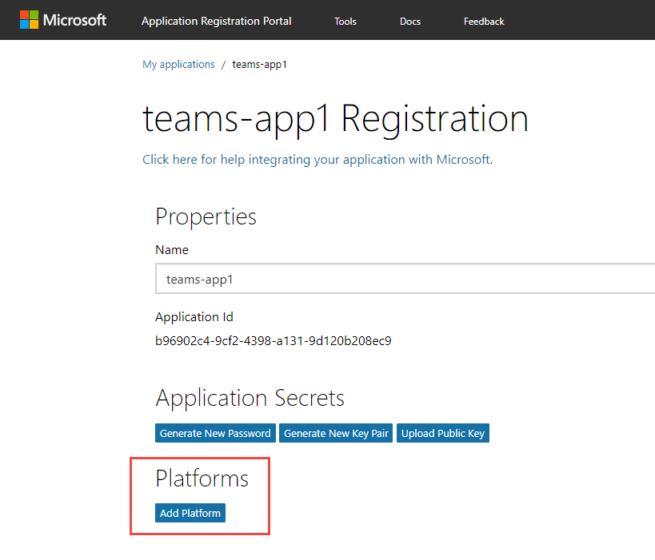

# <a name="exercise3"></a>

## Exercise 3: Call the Microsoft Graph API inside a tab

이번 핸즈온랩 세션은 Exercise 1 에서 만들었던 탭을 좀 더 확장하여 Microsoft Graph API 를 호출하도록 할 것입니다. 이번 Exercise 는 상당히 많은 양의 코드가 사용됩니다. **Lab Files** 폴더에 코드파일이 있으니, 그 파일을 열어서 코드를 복사하시길 바랍니다.

### Run the ngrok secure tunnel application

1. 새로운 **Command Prompt** 창을 엽니다.

1. **ngrok.exe** 프로그램이 있는 디렉토리로 이동합니다.

1. 다음 명령어를 실행합니다. `ngrok http 3007`.

1. ngrok 프로그램이 전체 프롬프트 창을 채울 것입니다. 이 때 HTTP 를 사용하는 포워딩 주소를 확인해 주십시오. 이 주소가 다음 단계에서 필요합니다.

1. ngrok 이 실행중인 프롬프트 창을 최소화 해두십시오. 이번 연습에서는 더이상 참고할 일이 없을 것입니다. 최소화 된 상태로 계속 실행중이어야 합니다.

    

### Register an application in AAD

이 프로그램이 Microsoft Graph API를 호출하게 하려면, 어플리케이션 등록이 필요합니다. 이 핸즈온랩에서는 [Azure Active Directory v2.0 endpoint](https://docs.microsoft.com/en-us/azure/active-directory/develop/active-directory-v2-compare) 을 사용합니다,

1. [Application Registration Portal](https://apps.dev.microsoft.com)에 접속합니다.

1. **a work or school account**을 이용해 로그인 하십시오.

1. **Add an app**을 선택합니다.

1. 어플리케이션 이름과 연락처 메일을 입력하여 **Register your application** 섹션의 입력을 끝마칩니다. **Guided Setup** 의 체크박스를 해제하고, **Create** 를 클릭합니다.

    

1. 등록 페이지에서, **Platforms** 섹션안에 있는 **Add Platform** 을 선택합니다.

    

1. **Add Platform** 대화창에서 **Web**을 선택합니다.

1. ngrok 에서 얻은 호스트네임을 이용해 **Redirect URL** 주소가 **auth.html**으로 끝나도록 입력합니다.

    ```
    https://[replace-this].ngrok.io/auth.html
    ```

1. **Add URL** 버튼을 선택합니다.

1. ngrok 에서 얻은 호스트네임을 이용해 **Redirect URL** 주소가 **adminconsent.html**으로 끝나도록 입력합니다

    ```
    https://[replace-this].ngrok.io/adminconsent.html
    ```

    

1. **Save**를 선택합니다.

1. application ID 를 따로 적어두십시오. 이 값이 나중에 authentication / token 코드에서 사용됩니다.

### Request permission to read groups

1. **Microsoft Graph Permissions** 섹션으로 이동합니다.

1. **Delegated Permissions** 옆에 있는 **Add** 버튼을 선택합니다.

1. **Select Permission** 대화창에서, 아래쪽으로 스크롤 다운하여 **Group.Read.All**을 선택합니다. **OK**를 클릭합니다.

      

1. **Save**를 클릭합니다.

### Add the Microsoft Authentication Library (MSAL) to the project

1. 새로운 **Command Prompt** 창을 엽니다.

1. 탭 어플리케이션이 있는 디렉토리로 이동합니다.

1. 아래의 명령어를 수행해 주십시오:

    ```shell
    npm install msal
    ```

### Configure tab when added to channel

이 Exercise 의 탭은 Microsoft Graph API를 통해 현재 사용자와 이 채널이 위치한 그룹에 대한 정보를 읽어 오도록 설정될 것입니다. 아래의 과정을 통해 탭 설정을 업데이트 해주세요.

**Note:** 아래의 과정에서는 Exercise 1 에서 만든 탭의 이름이 **teams-app-1** 인 것으로 가정하고 있습니다. 이 섹션의 경로들은 생성된 프로그램의 **src/app/** 폴더에 위치하고 있습니다.

1. **scripts/teamsApp1TabConfig.tsx** 파일을 여십시오.

1. 파일의 제일 위에는 `import` 선언문이 있으며, `msteams-ui-components-react` 이 제공하는 몇가지 컴포넌트들이 나열되어 있습니다. 이 컴포넌트의 목록에 `Dropdown` 을 추가해 주십시오.

1. `IteamsApp1TabConfigState` 클래스를 찾으십시오. `value` 속성의 이름을 `selectedConfiguration`으로 바꾸십시오.

    ```typescript
    export interface IteamsApp1TabConfigState extends ITeamsBaseComponentState {
      selectedConfiguration: string;
    }
    ```

1. `teamsApp1TabConfig` 클래스를 찾으십시오. 첫번째 메소드의 앞에 아래 코드라인들을 삽입하여 멤버변수들을 추가합니다.

    ```typescript
    configOptions = [
      { key: 'MBR', value: 'Member information' },
      { key: 'GRP', value: 'Group information (requires admin consent)' }
    ];
    selectedOption: string = "";
    tenantId?: string = "";
    ```

1. `teamsApp1TabConfig` 클래스 안에서 `componentWillMount` 메소드를 찾으십시오. 이 메소드 안에 `microsoftTeams.getContext` 을 호출하는 부분이 있습니다. 이 `getContext` 콜백을 아래와 같이 변경하여 적절한 정적 변수를 사용하게 하고 테넌트 아이디도 업데이트 할 수 있도록 해줍니다.

    ```typescript
    microsoftTeams.getContext((context: microsoftTeams.Context) => {
      this.tenantId = context.tid;
      this.setState({
        selectedConfiguration: context.entityId
      });
      this.setValidityState(true);
    });
    ```

1. `componentWillMount` 메소드 안에서 `microsoftTeams.settings.setSettings`를 호출하는 부분을 찾으십시오. 이 메소드 호출안에서 파라미터를 아래와 같이 업데이트 하여, 적절한 정적 변수를 사용할 수 있도록 해줍니다.

    ```typescript
    microsoftTeams.settings.setSettings({
      contentUrl: host + "/teamsApp1Tab.html?data=",
      suggestedDisplayName: 'teams app1 Tab',
      removeUrl: host + "/teamsApp1TabRemove.html",
      entityId: this.state.selectedConfiguration
    });
    ```

1. `teamsApp1TabConfig` 클래스에 아래의 코드 조각을 새로운 메소드로 추가해줍니다.

    ```typescript
    private onConfigSelect(cfgOption: string) {
      let selectedItem = this.configOptions.filter((pos, idx) => pos.key === cfgOption)[0];
      if (selectedItem) {
        this.setState({
          selectedConfiguration: selectedItem.key
        });
        this.selectedOption = selectedItem.value;
        this.setValidityState(true);
      }
    }
    ```

1. 탭 설정 페이지에는 관리자의 동의를 얻기 위한 버튼이 있습니다. 관리자의 동의를 얻기 위해서는 `tenantId` 가 필요한데, 이것은 런타임 시점 이전에는 알 수 없으므로 버튼의 `onclick` 이벤트를 사용해야 합니다. 아래의 함수를 `teamsApp1TabConfigure` 클래스에 추가해 주십시오.

    ```typescript
    private getAdminConsent() {
      microsoftTeams.authentication.authenticate({
        url: "/adminconsent.html?tenantId=" + this.tenantId,
        width: 800,
        height: 600,
        successCallback: () => { },
        failureCallback: (err) => { }
      });
    }
    ```

1. `<PanelHeader>` 태그를 찾으십시오. `<div>` 태그의 텍스트를 아래와 같이 변경합니다.

    ```html
    <div style={styles.header}>Settings</div>
    ```

1. `<PanelBody>` 태그를 찾으십시오. Replace the contents of the `<PanelBody>` 태그의 내용을 아래의 코드조각으로 교체 해주십시오.

    ```typescript
    <PanelBody>
      <div style={styles.section}>Microsoft Graph Functionality</div>
      <Dropdown
        autoFocus
        mainButtonText={this.selectedOption}
        style={{ width: '100%' }}
        items={
          this.configOptions.map((cfgOpt, idx) => {
            return ({ text: cfgOpt.value, onClick: () => this.onConfigSelect(cfgOpt.key) });
          })
        }
      />
      <div style={styles.section}>
        <PrimaryButton onClick={() => this.getAdminConsent()}>Provide administrator consent - click if Tenant Admin</PrimaryButton>
      </div>
    </PanelBody>
    ```

1. **web** 폴더에 새로운 파일을 추가하고 **adminconsent.html**이라고 파일명을 정해 주십시오.

1. **adminconsent.html** 파일애 아래의 내용을 추가합니다.

    ```html
    <!DOCTYPE html>
    <html lang="en">

    <head>
      <meta charset="UTF-8">
      <title>AdminConsent</title>
      <!-- inject:css -->
      <!-- endinject -->
    </head>

    <body>
      <script src="https://statics.teams.microsoft.com/sdk/v1.0/js/MicrosoftTeams.min.js"></script>
      <!-- inject:js -->
      <!-- endinject -->

      <script type="text/javascript">
        function getURLParam(name) {
          var url = window.location.search.substring(1);
          var variables = url.split('&');
          for (var i = 0; i < variables.length; i++) {
            var variable = variables[i].split('=');
            if (variable[0] === name) {
              return decodeURIComponent(variable[1]);
            }
          }
        }

        var ac = new teamsApp1.AdminConsent();

        var response = getURLParam("admin_consent");
        if (response) {
          ac.processResponse(true);
        } else {
          var error = getURLParam("error_description")
          if (error) {
            ac.processResponse(false, error);
          } else {
            var tenantId = getURLParam("tenantId");
            ac.requestConsent(tenantId);
          }
        }
      </script>
    </body>
    </html>
    ```

1. **scripts** 폴더에 새로운 파일을 추가하고 **adminconsent.ts** 이라고 파일명을 정해 주십시오.

1. **adminconsent.ts** 파일에 아래의 코드들을 추가해주십시오. `app-id-from-registration`이라는 이름의 토큰이 있는데 이 값은 꼭 변경해 주셔야 합니다. 어플리케이션 등록 페이지에서 복사해 두었던 어플리케이션 ID 값을 사용하시면 됩니다.

    ```typescript
    /**
    * Implementation of the teams tab1 AdminConsent page
    */
    export class AdminConsent {
      /**
      * Constructor for Tab that initializes the Microsoft Teams script and themes management
      */
      constructor() {
        microsoftTeams.initialize();
      }

      public requestConsent(tenantId:string) {
        let host = "https://" + window.location.host;
        let redirectUri = "https://" + window.location.host + "/adminconsent.html";
        let clientId = "[app-id-from-registration]";
        let state = "officedev-trainingconent"; // any unique value

        var consentEndpoint = "https://login.microsoftonline.com/common/adminconsent?" +
                              "client_id=" + clientId +
                              "&state=" + state +
                              "&redirect_uri=" + redirectUri;

        window.location.replace(consentEndpoint);
      }

      public processResponse(response:boolean, error:string){
        if (response) {
          microsoftTeams.authentication.notifySuccess();
        } else {
          microsoftTeams.authentication.notifyFailure(error);
        }
      }
    }
    ```

1. **scripts/client.ts** 파일을 찾아서 엽니다.

1. **scripts/client.ts** 파일의 가장 아래쪽에 아래 코드문을 추가하십시오.

    ```typescript
    export * from './adminconsent';
    ```

1. [Exercise 1]("#exercise1") 에서 사용했던 방식을 다시 적용하여 , 앱을 배포해 주십시오.

1. 채널에 탭을 추가하거나, 기존에 추가되어 있던 탭의 설정을 업데이트 해주십시오. 이미 추가되어 있는 탭의 설정을 업데이트 하려면, 탭 이름 옆에 있는 **V** 표시를 클릭하시면 됩니다.

    

1. **Provide administrator consent - click if Tenant Admin** 버튼을 클릭하십시오.

    

1. Azure Active Directory 에 로그인 하여 동의절차가 완료되었는지 확인해 주십시오. 만약 로그인한 계정이 테넌트 관리자가 아니라면, 동의 절차가 실패할 것입니다. 관리자의 동의를 얻는 것은 단지 그룹 캘린더를 보기위해서만 필요하고, 멤버 정보를 보기 위해 필요한 것은 아닙니다.

    

### Content page and authentication

탭이 설정되면 그에 따라 필요한 정보가 컨텐츠 페이지에 표시될 것입니다. 탭 컨텐츠를 업데이트 하기 위해 아래의 작업을 진행해 주십시오.

**Note:** 아래의 과정에서는 Exercise 1 에서 만든 탭의 이름이 **teams-app-1** 인 것으로 가정하고 있습니다. 이 섹션의 경로들은 생성된 프로그램의 **src/app/** 폴더에 위치하고 있습니다.

1. **scripts/teamsApp1Tab.tsx** 파일을 여십시오.

1. `IteamsApp1TabState` 인터페이스를 찾으십시오. 인터페이스 데피니션 부분을 아래의 코드로 교체해 주십시오.

    ```typescript
    export interface IteamsApp1TabState extends ITeamsBaseComponentState {
      entityId?: string;
      graphData?: string;
    }
    ```

1. `teamsApp1Tab` 클래스를 찾으십시오. 아래의 클래스 변수선언은 추가해 주십시오.

    ```typescript
    configuration?: string;
    groupId?: string;
    token?: string;
    ```

1. `teamsApp1Tab` 객체에 아래의 함수를 추가해 주십시오. 이 함수는 버튼을 클릭했을 때 동작합니다.

    ```typescript
    private getGraphData() {
      let token = "";

      this.setState({ graphData: "Loading..." });
      if (token == "") {
        microsoftTeams.authentication.authenticate({
          url: "/auth.html",
          width: 400,
          height: 400,
          successCallback: (data) => {
            // Note: token is only good for one hour
            token = data!;
            this.getData(token);
          },
          failureCallback: function (err) {
            document.getElementById("graph")!.innerHTML = "Failed to authenticate and get token.<br/>" + err;
          }
        });
      }
      else {
        this.getData(token);
      }
    }
    ```

1. `teamsApp1TabTab` 클래스에 아래의 메소드를 추가해 주십시오. 이 메소드는 Microsoft Graph API 를 호출하여 그 결과를 화면에 표시하기 위해 XMLHTTP 를 사용합니다.

    ```typescript
    public getData(token: string) {
      let graphEndpoint = "https://graph.microsoft.com/v1.0/me";
      if (this.configuration === "GRP") {
        graphEndpoint = "https://graph.microsoft.com/v1.0/groups/" + this.groupId;
      }

      var req = new XMLHttpRequest();
      req.open("GET", graphEndpoint, false);
      req.setRequestHeader("Authorization", "Bearer " + token);
      req.setRequestHeader("Accept", "application/json;odata.metadata=minimal;");
      req.send();
      var result = JSON.parse(req.responseText);
      this.setState({ graphData: JSON.stringify(result, null, 2) });
    }
    ```

1. `teamsApp1TabTab` 클래스에 `componentWillMount` 메소드를 찾으십시오. 이 메소드 안에 `microsoftTeams.getContext` 을 호출하는 부분이 있습니다. 이 `getContext` 콜백을 아래와 같이 변경해 변경해 주십시오.

    ```typescript
    microsoftTeams.getContext((context) => {
      this.configuration = context.entityId;
      this.groupId = context.groupId;
    });
    ```

1. `<PanelBody>` 태그를 찾으십시오. 태그를 아래의 코드 조각으로 교체하십시오.

    ```typescript
    <PanelBody>
      <div style={styles.section}>
        {this.state.graphData}
      </div>
      <div style={styles.section}>
        <PrimaryButton onClick={() => this.getGraphData()}>Get Microsoft Graph data</PrimaryButton>
      </div>
    </PanelBody>
    ```

1. **web** 폴더에 새로운 파일을 추가하고 **auth.html** 이라고 이름을 지어주십시오.

1. **auth.html** 파일에 아래의 내용을 추가해 주십시오.

    ```html
    <!DOCTYPE html>
    <html lang="en">
    <head>
      <meta charset="UTF-8">
      <title>Auth</title>
      <!-- inject:css -->
      <!-- endinject -->
    </head>
    <body>
      <script src="https://secure.aadcdn.microsoftonline-p.com/lib/0.1.1/js/msal.min.js"></script>
      <script src="https://statics.teams.microsoft.com/sdk/v1.0/js/MicrosoftTeams.min.js"></script>
      <!-- inject:js -->
      <!-- endinject -->
      <script type='text/javascript'>
        var auth = new teamsApp1.Auth();
        auth.performAuthV2();
      </script>
    </body>
    </html>
    ```

1. **scripts** 폴더에 새로운 파일을 추가하고 **auth.ts** 이라고 이름을 지어주십시오.

1. **auth.ts** 파일에 아래 내용을 추가해 주십시오. `[app-id-from-registration]` 이라는 이름의 토큰이 꼭 변경되어야 하는 점에 유의해 주십시오. 어플리케이션 등록 페이지에서 복사해둔 어플리케이션 아이디의 값을 사용하시면 됩니다.

    ```typescript
    import * as Msal from 'msal';
    /**
    * Implementation of the teams app1 Auth page
    */
    export class Auth {
      private token: string = "";
      private user: Msal.User;

      /**
      * Constructor for Tab that initializes the Microsoft Teams script
      */
      constructor() {
        microsoftTeams.initialize();
      }

      public performAuthV2(level: string) {
        // Setup auth parameters for MSAL
        let graphAPIScopes: string[] = ["https://graph.microsoft.com/user.read", "https://graph.microsoft.com/group.read.all"];
        let userAgentApplication = new Msal.UserAgentApplication(
                                            "[app-id-from-registration]",
                                            "https://login.microsoftonline.com/common",
                                            this.tokenReceivedCallback);

        if (userAgentApplication.isCallback(window.location.hash)) {
          var user = userAgentApplication.getUser();
          if (user) {
            this.getToken(userAgentApplication, graphAPIScopes);
          }
        } else {
          this.user = userAgentApplication.getUser();
          if (!this.user) {
            // If user is not signed in, then prompt user to sign in via loginRedirect.
            // This will redirect user to the Azure Active Directory v2 Endpoint
            userAgentApplication.loginRedirect(graphAPIScopes);
          } else {
            this.getToken(userAgentApplication, graphAPIScopes);
          }
        }
      }

      private getToken(userAgentApplication: Msal.UserAgentApplication, graphAPIScopes: string[]) {
        // In order to call the Microsoft Graph API, an access token needs to be acquired.
        // Try to acquire the token used to query Microsoft Graph API silently first:
        userAgentApplication.acquireTokenSilent(graphAPIScopes).then(
          (token) => {
            //After the access token is acquired, return to MS Teams, sending the acquired token
            microsoftTeams.authentication.notifySuccess(token);
          },
          (error) => {
            // If the acquireTokenSilent() method fails, then acquire the token interactively via acquireTokenRedirect().
            // In this case, the browser will redirect user back to the Azure Active Directory v2 Endpoint so the user
            // can reenter the current username/ password and/ or give consent to new permissions your application is requesting.
            if (error) {
              userAgentApplication.acquireTokenRedirect(graphAPIScopes);
            }
          }
        );
      }

      private tokenReceivedCallback(errorDesc, token, error, tokenType) {
        //  suppress typescript compile errors
      }
    }
    ```

1. **scripts/client.ts** 파일을 찾으십시오. **scripts/client.ts** 파일의 가장 아래쪽에 아래 코드문을 추가해 주십시오.

    ```typescript
    export * from './auth';
    ```

1. 팀즈의 탭을 새로고침 해주십시오. **Get Microsoft Graph Data** 버튼을 클릭하여 인증페이지를 호출하여 로그인해주면 **graph.microsoft.com**으로 접속하여 정보를 가져옵니다.

    